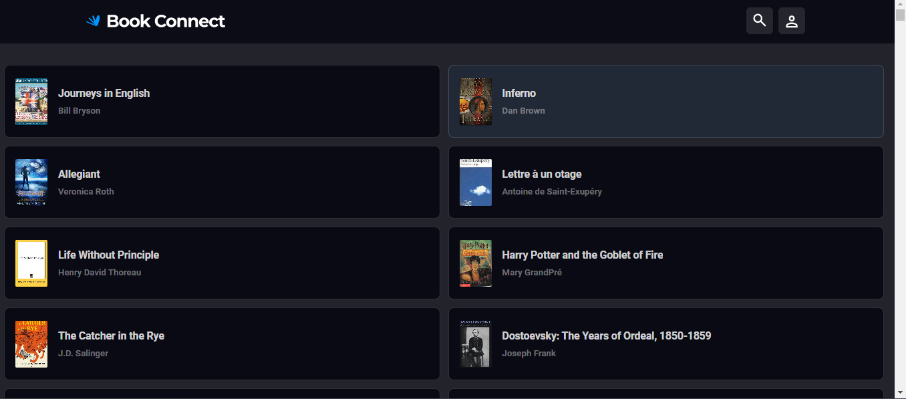

# Welcome to Book Connect 👋         

## Author:  
Sumaiya Mohamed

## Title: 
  _Book Connect App_

## Technologies Used:
* HTML
* CSS 
* JavaScript
* Figma

## Design:
https://www.figma.com/file/hrpqHnTHH1Ems9wMU0EBOH/Book-connect?type=design&mode=design&t=Ely1ijIgbE2TFaY1-1

## Description:
  Book Connect is a versatile book app that makes finding new books easier for new readers or bookworms. With its intuitive interface and powerful features, Book Connect helps you explore, filter, and access comprehensive information about a vast collection of books. 

## Key Features:

1. **Smart Book Filtering** : Book Connect allows you to filter books effortlessly by title, author, or genre. Whether you're searching for a specific book or exploring works by your favorite author, the app quickly narrows down the results to match your criteria.

1. **Theme Customization** : Personalize your reading environment with Book Connect's theme options. Seamlessly switch between light and dark modes to suit your preferences and create a comfortable reading experience.

1. **Comprehensive Book Information** : Book Connect offers detailed book information at your fingertips. Each book entry includes essential details such as author, published date, title, and a summary. This way, you can quickly assess the relevance and appeal of a book before deciding to delve into it.

1. **User-Friendly Interface** : The intuitive layout and smooth navigation ensure a seamless and enjoyable experience while interacting with the app.

## Requirements:
* Live sever extension.

## How to use: 
1. Download the file.
1. Extract the file.
1. Open in vscode.
1. Open live server.

## Contact Details:
Email: sumaiyamohamed58@gmail.com
